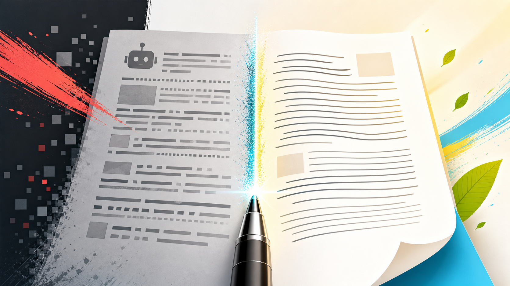

# Zu Article Polisher Skill



> 说明：这个 skill 的一部分内容参考了国外 Humanizer 开源项目对 AI 写作痕迹的识别思路。当前版本已经按我的中文写作场景做了改造，更适合国内中文文档、技术文章、观点稿、口播稿、演讲稿等内容的去 AI 味和润色。

Zu Article Polisher 是一个面向中文技术表达的 skill。它的目标不是把文字改得更华丽，而是拆掉 AI 生成内容里常见的模板骨架，保留作者原本的判断、事实和技术边界，让文章更像一个真实、有经验的工程师写出来。

它适合处理：

- 中文技术文章、观点长文、公众号草稿
- 口播稿、演讲稿、分享稿
- AI 初稿的二次整理和发布前检查

## 核心能力

### 1. 去除中文 AI 味

识别并处理中文内容里常见的 AI 写作痕迹，例如：

- 模板开场和假问题
- `不是...而是...`、`不仅仅是...更是...` 这类 GPT 经典的否定式排比
- 三段式结构、强行列点、粗体小标题列表
- 空泛意义升华、句尾强行总结
- 宣传腔、白皮书腔、行业黑话
- 模糊归因和无来源背书
- 过度平衡、套路化挑战与展望
- 聊天回复残留和模型免责声明

### 2. 保留作者真实判断

这个 skill 优先保留作者自己的观点、经验和技术 caveat。它不会为了让文字更自然而凭空添加年份、数字、案例、来源、用户反馈或更激进的判断。

处理技术观点文时，它会优先保护这些内容：

- 明确判断
- 工程边界
- 成本、权限、稳定性、评测、迁移、维护等真实约束
- 原文已有的事实和观点归属

### 3. 重建文章结构

它会先提炼文章真实主张，再围绕主张重写段落，而不是只做同义词替换。

常见处理方式包括：

- 把假问题改成判断句
- 删除空泛铺垫和重复总结
- 调整段落顺序，让核心观点更早出现
- 同步阅读大纲、正文标题和章节编号
- 收敛标题、列表、表格和 Markdown 格式

### 4. 支持发布前检查

仓库内置了一个辅助脚本：

```bash
python3 scripts/check_article_style.py <markdown-file>
```

脚本只负责定位疑似问题，不会自动改写文章。它可以检查：

- 阅读大纲和正文标题是否一致
- 章节编号是否连续
- 固定 AI 句式和模板结构
- 术语大小写
- 粗体滥用、空行、尾随空格等 Markdown 问题

## 文件结构

```text
.
├── SKILL.md
├── agents/
│   └── openai.yaml
├── references/
│   └── style-guide.md
└── scripts/
    └── check_article_style.py
```

- `SKILL.md`：skill 的主说明和工作流。
- `references/style-guide.md`：中文 AI 写作痕迹模式库和改写原则。
- `scripts/check_article_style.py`：发布前辅助检查脚本。
- `agents/openai.yaml`：OpenAI agent 展示信息和默认提示词。

## 使用边界

这个 skill 不是通用润色器，也不是 AI 检测器。它更适合有明确观点、有技术内容、有发布目标的中文材料。

它不会替作者补事实，也不会把原文改成中立白皮书语气。缺少事实支撑时，正确做法是把表达改得更朴素，或者明确提示需要补来源。

## 同类 Skill 关联推荐

- 文章完成后，需要插图配图，可使用下面 Skill 做插图，会先根据文章整体内容做图片插入的判断，生成中间态插图 Prompt 标签在文章内确认，确认后生图。
- 内部提供常用插图的多种场景、类型、样式主题自由选择

[zu-article-image-skill](https://github.com/wwenj/zu-article-image-skill)
